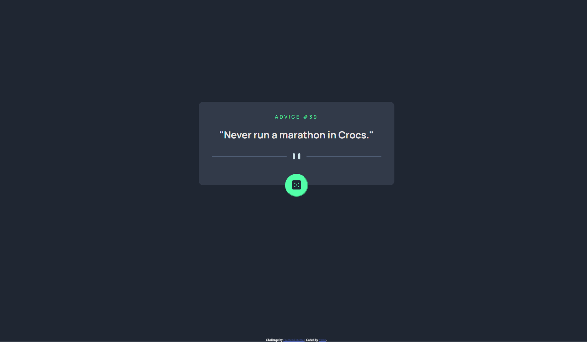

# Frontend Mentor - Advice Generator App solution

This is a solution to the [Advice Generator App challenge on Frontend Mentor](https://www.frontendmentor.io/challenges/advice-generator-app-QdUG-13db). Frontend Mentor challenges help you improve your coding skills by building realistic projects.

### User Requirements

Users should be able to:

- View the optimal layout for the app depending on their device's screen size
- See hover states for all interactive elements on the page
- Generate a new piece of advice by clicking the dice icon

### Screenshot

### Links

- Solution URL: [Solution Site](https://www.frontendmentor.io/solutions/advice-generator-app-XMK8RPsaed)
- Live Site URL: [Live Site](https://advice-generator-app-main-pi-eight.vercel.app/)

### Built with

- HTML
- CSS
- JavaScript
- Advice Slip API

